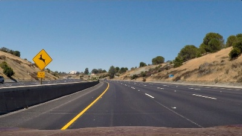
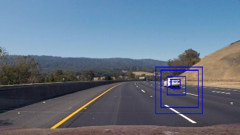
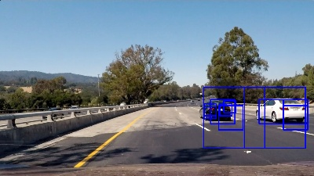
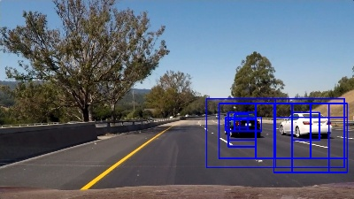

# Vehicle Detection Project

The goals / steps of this project are the following:

* Perform a Histogram of Oriented Gradients (HOG) feature extraction on a labeled training set of images and train a classifier Linear SVM classifier
* Optionally, you can also apply a color transform and append binned color features, as well as histograms of color, to your HOG feature vector. 
* Note: for those first two steps don't forget to normalize your features and randomize a selection for training and testing.
* Implement a sliding-window technique and use your trained classifier to search for vehicles in images.
* Run your pipeline on a video stream (start with the test_video.mp4 and later implement on full project_video.mp4) and create a heat map of recurring detections frame by frame to reject outliers and follow detected vehicles.
* Estimate a bounding box for vehicles detected.

[//]: # (Image References)
[image1]: ./examples/car_not_car.png
[image2]: ./examples/HOG_example.jpg
[image3]: ./examples/sliding_windows.jpg
[image4]: ./examples/sliding_window.jpg
[image5]: ./examples/bboxes_and_heat.png
[image6]: ./examples/labels_map.png
[image7]: ./examples/output_bboxes.png
[video1]: ./project_video.mp4

## [Rubric](https://review.udacity.com/#!/rubrics/513/view) Points
### Here I will consider the rubric points individually and describe how I addressed each point in my implementation.  

---
### Writeup / README

#### 1. Provide a Writeup / README that includes all the rubric points and how you addressed each one.  You can submit your writeup as markdown or pdf.  [Here](https://github.com/udacity/CarND-Vehicle-Detection/blob/master/writeup_template.md) is a template writeup for this project you can use as a guide and a starting point.  

You're reading it!

### Histogram of Oriented Gradients (HOG)

#### 1. Explain how (and identify where in your code) you extracted HOG features from the training images. Explain how you settled on your final choice of HOG parameters.

The code for this step is contained in the [training_data.py] file. The
[load_training_data()] method loads the vechile and non-vehicle images,
calculate [HOG][calculate_hog_features] and [color][calculate_color_features]
features for each image and [associate each image with a label].
I used the `skimage.hog()` method to obtain HOG features for each channel of
a training image. I used the default value of 9 for the number of
orientations and the default value of `(8, 8)` for the size of a cell. After
I settled with the classifier, I tried values of `(1, 1)` and `(3, 3)` for
the number of cells per a block and selected the value of `(1, 1)`, because
it provided slightly higher FPS and I didn't notice a big difference
in the quality of detection compare to the value of `(3, 3)`. I merge HOG
features calculated for each of the RGB channels of a training image. I
[combine][combine_features] HOG features with color features. To obtain
color features I down scale image to the size of 16x16 pixels and flatten
the resulted image into a vector of floats.

If you run the [training_data.py] script, it will extract features and
generate labels represented by numpy arrays and [save][save_training_data]
them into the `traingin_data.pkl` file. This will speed up loading of
the training data during iterative training of the classifier.

[training_data.py]: ./training_data.py
[load_training_data()]: https://github.com/mode89/CarND-Vehicle-Detection/blob/master/training_data.py#L11
[calculate_hog_features]: https://github.com/mode89/CarND-Vehicle-Detection/blob/master/training_data.py#L46
[calculate_color_features]: https://github.com/mode89/CarND-Vehicle-Detection/blob/master/training_data.py#L56
[associate each image with a label]: https://github.com/mode89/CarND-Vehicle-Detection/blob/master/training_data.py#L37
[save_training_data]: https://github.com/mode89/CarND-Vehicle-Detection/blob/master/training_data.py#L67
[combine_features]: https://github.com/mode89/CarND-Vehicle-Detection/blob/master/training_data.py#L44

#### 2. Describe how (and identify where in your code) you trained a classifier using your selected HOG features (and color features if you used them).

The code for this step is contained in the [classification.py] file. I
trained the multi-layer perceptron using the `sklearn.neural_network.MLPClassifier`
class. First, I [split training and test data] using the `sklearn.model_selection.train_test_split`
method. Then I [normalize training features] using the `sklearn.preprocessing.StandardScaler`
class. Then [train the classifier] and [save the trained model] into a file.
Loading the trained model from a file speeds up detection pipeline.

If you run the [classification.py] script, it will train the classifier and
save the trained model into the `classifier.pkl` file.

[classification.py]: ./classification.py
[split training and test data]: https://github.com/mode89/CarND-Vehicle-Detection/blob/master/classification.py#L14
[normalize training features]: https://github.com/mode89/CarND-Vehicle-Detection/blob/master/classification.py#L19
[train the classifier]: https://github.com/mode89/CarND-Vehicle-Detection/blob/master/classification.py#L24
[save the trained model]: https://github.com/mode89/CarND-Vehicle-Detection/blob/master/classification.py#L37

### Sliding Window Search

#### 1. Describe how (and identify where in your code) you implemented a sliding window search.  How did you decide what scales to search and how much to overlap windows?

I've implemented a multiscale sliding window search. The code for this step
is contained in the [pipeline.py] script, the [`Pipeline.sliding_windows()`]
method. The size of window and number of scales is controlled by the global
variables `MIN_WINDOW_SIZE = 50`, `MAX_WINDOW_SIZE = 250` and
`WINDOW_SCALE_STEP = 50`. Which means that we go through square windows of
the following sizes: 50x50, 100x100, 150x150, 200x200 and 250x250. I assumed
that a car with image smaller than 50 pixels can be considered as too far,
and a car cannot be bigger than 250 pixels. For each of the window scales
I scan 5 overlapped rows near the [`HORIZON_LINE = 440`][horizon_line]. I've
noticed that the horizon line cuts a car image of any scale with the
approximate ratio of 1:2 (one part above horizon line and two parts below
the horizon line), which is represented by variable. Based on this fact,
I [calculate the position of each row] of windows. Each row of windows
overlaps an adjacent row by 4/5 of the window size. Each window in a row
overlaps the adjacent window by 3/4 of the window size. I've started with
the amount of overlapping equal to 1/2 of the window size. But bigger
overlapping can produce a more contrast heat map, that's why I've started
increasing overlapping and stopped on the selected numbers, because further
increasing means more processing time. The `sliding_windows()` method yields
an list of index masks, that can be applied to the original image to
retrieve the corresponding windows.

[pipeline.py]: ./pipeline.py
[`Pipeline.sliding_windows()`]: https://github.com/mode89/CarND-Vehicle-Detection/blob/master/pipeline.py#L18
[horizon_line]: https://github.com/mode89/CarND-Vehicle-Detection/blob/master/pipeline.py#L11
[calculate the position of each row]: https://github.com/mode89/CarND-Vehicle-Detection/blob/master/pipeline.py#L29

#### 2. Show some examples of test images to demonstrate how your pipeline is working.  What did you do to optimize the performance of your classifier?

To optimize the performance of the classifier, I've tried the following
things:
* mix in color features with HOG features
* using different color spaces (RGB and YUV)
* different parameters of HOG extraction (number of orientations, number of
  cells, number of blocks)
* hard negative mining

Here are some example images of working classifier:

### Video Implementation

#### 1. Provide a link to your final video output.  Your pipeline should perform reasonably well on the entire project video (somewhat wobbly or unstable bounding boxes are ok as long as you are identifying the vehicles most of the time with minimal false positives.)
Here's a [link to my video result](./project_video.mp4)

#### 2. Describe how (and identify where in your code) you implemented some kind of filter for false positives and some method for combining overlapping bounding boxes.

I recorded the positions of positive detections in each frame of the video.
From the positive detections I [created a heatmap] and then [thresholded that map]
to identify vehicle positions. I then used `scipy.ndimage.measurements.label()`
to [identify individual blobs] in the heatmap. Then [assumed] each blob
corresponded to a vehicle. I [filtered out] those blobs that look tall.
I [constructed bounding boxes] to cover the area of each blob left.

[created a heatmap]: https://github.com/mode89/CarND-Vehicle-Detection/blob/master/pipeline.py#L45
[thresholded that map]: https://github.com/mode89/CarND-Vehicle-Detection/blob/master/pipeline.py#L50
[identify individual blobs]: https://github.com/mode89/CarND-Vehicle-Detection/blob/master/pipeline.py#L51
[assumed]: https://github.com/mode89/CarND-Vehicle-Detection/blob/master/pipeline.py#L64
[filtered out]: https://github.com/mode89/CarND-Vehicle-Detection/blob/master/pipeline.py#L68
[constructed bounding boxes]: https://github.com/mode89/CarND-Vehicle-Detection/blob/master/pipeline.py#L53

---

### Discussion

#### 1. Briefly discuss any problems / issues you faced in your implementation of this project.  Where will your pipeline likely fail?  What could you do to make it more robust?

The main issue that I faced, was the presence of the false positives. As a
workaround I performed hard negative mining on the test image. It worked,
but there is still a chance that the classifier will fail on the new unseen
data. Using a bigger training dataset will make the algorithm more robust.

Another issue is the computational time - the algorithm cannot perform in
real time. Current implementation performs resizing and feature extraction
for each of the windows separately. Those windows overlap each other, which
means, if we could resize and extract features from the whole ROI, we can
avoid redundant operations and improve frame rate.
